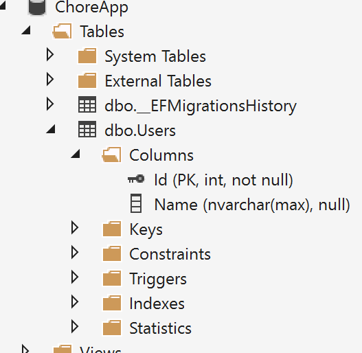
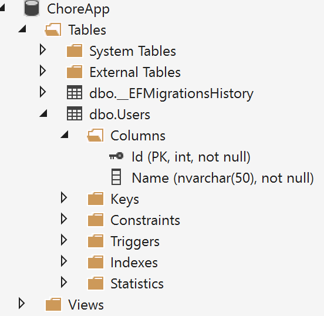
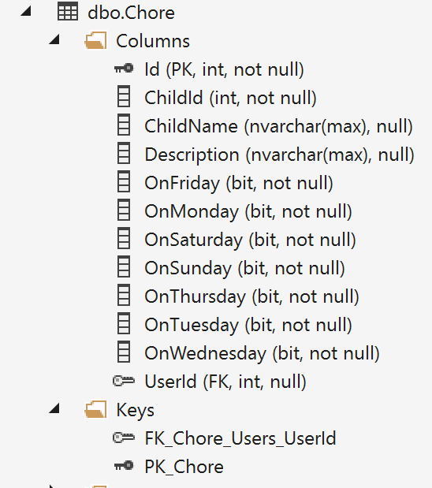
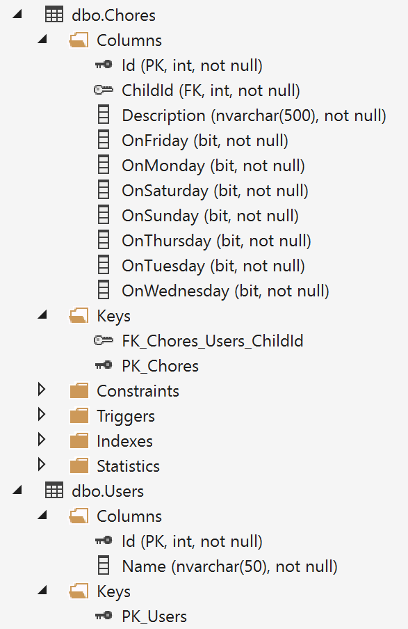
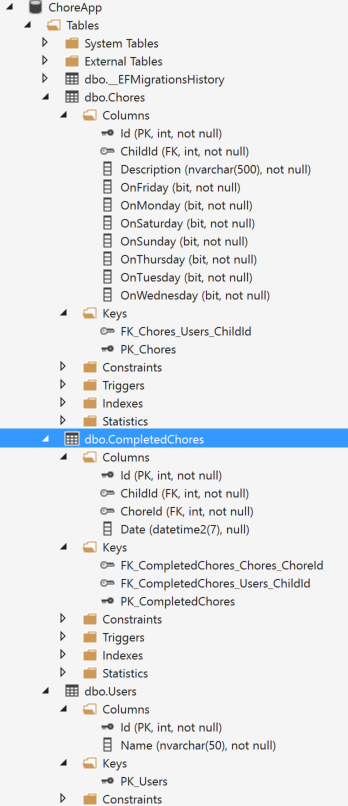

# EF Core
We are going to pick up from the last session and work with the `ChoreRepository.cs` file and add database support through `EF Core`. The following walk through is a step-by-step guide for accomplishing this. It does not cover all aspects of `EF Core`, but should provide a good starting point and foundation for working with it.

The ChoreRepository did an excellent job of outlining the models and behavior needed for the ChoreApp, and now is the time to start moving the project to forward.  One of the primary strength of MVC is how it lends itself to separating concerns. We could have one project and dump everything into it, but that's no fun. The **Start** folder contains a refactored version of the SimpleAspNetCore application to help get things started for this session. The primary changes other than moving the classes to individual files is the domain models are moved into its own project. Below is an outline of the changes that were made. 

1. Solution renamed to ChoreApp because it will be containing more than just the SimpleAspNetCore project.
2. A .NET Core Library project named "ChoreApp" was added. 
3. The models classes from the ChoreRepository file were moved to this project 
    and refactored to work with EF Core by adding parameter less contractors, 
    and changing private property setters to public.
4. The exception classes were also moved to this project.
5. An interface was extracted from the ChoreRepostory class and added to the Contracts folder.

The SimpleAspNetCore project have the following changes

1. Reference to ChoreApp library project was added.
2. ChoreRepository class was renamed to ChoreRepositoryStub and inherits from IChoreRepository.
3. Startup changes
   1. DI changed to use IChoreRepository
4. Controller changes
   1. Change ChoreRepository to use IChoreRepository


## Adding EF Core project
To get things rolling lets start by adding a new console project to our solution.

1. Add a new project by selecting File -> New -> Project
2. Select .NET Core on the left of the New Project dialog box
3. Select Console Application (.NET Core)
4. Name the project ChoreApp.DataStore

The reason we are using a Console Application rather than a Class Library project has to do with the tooling for Migrations. The .NET Core CLI must be able to run a .NET Core app that targets a framework and class Library projects are built without a framework. Therefore dotnet-ef cannot run against a library project. So as of now if you want to separate your EF Core code and use Data Migrations a console app is the only option.

To add EF Core open the project.json file and add the following to "dependencies" 
```javascript
    "Microsoft.EntityFrameworkCore.SqlServer": "1.0.1",
    "Microsoft.EntityFrameworkCore.Tools": "1.0.0-preview2-final",
```
Add the following "tools" section after "dependencies"
```javascript
  "tools": {
    "Microsoft.EntityFrameworkCore.Tools": {
      "version": "1.0.0-preview2-final",
      "type": "build"
    } 
  },
```
By adding `Microsoft.EntityFrameworkCore.SqlServer` this will provide support for EF Core and the SQL Server Data Provider. If you wanted to target a different provider like SQLite you would use `Microsoft.EntityFrameworkCore.SQLite`. The other settings are strictly for tooling and how Migrations are executed.

Since we want our data access to participate with dependency injection we also need to add the following to dependences.

```javascript
    "Microsoft.Extensions.Configuration": "1.0.1",
    "Microsoft.Extensions.Configuration.Abstractions": "1.0.1",
    "Microsoft.Extensions.Configuration.FileExtensions": "1.0.1",
    "Microsoft.Extensions.Configuration.Json": "1.0.1"
```
Before we can build our data access code we need to add a reference to the `ChoreApp` library to dependencies.
```javascript
    "ChoreApp": { "target": "project" },
```

Add a new class named `ChoreAppDbContext.cs` and have it inherit from `DbContext`.

```c#
    public class ChoreAppDbContext : DbContext
    {
       
    }
```

Add the following for the constructor. This constructor will be used for Dependency Injection.
```c#
    private readonly IConfigurationRoot _configurationRoot;

    public ChoreAppDbContext(DbContextOptions<ChoreAppDbContext> options, IConfigurationRoot configurationRoot)
    {
        _configurationRoot = configurationRoot;
    }
```
Add the following code to override the OnConfiguring method. This will instruct EF that we want to use SQL Server as our datastore.
```c#
    protected override void OnConfiguring(DbContextOptionsBuilder optionsBuilder)
    {
        base.OnConfiguring(optionsBuilder);
        optionsBuilder.UseSqlServer(_configurationRoot["Data:ConnectionString"]);
    }
```
To add the  connection string need in `OnConfiguring` add a new `JSON` file named `appsettings.json` with: 

```javascript
  "Data": {
    "ConnectionString": "Data Source=(localdb)\\MSSQLLocalDB;Initial Catalog=ChoreApp;Integrated Security=True;Connect Timeout=30;Encrypt=False;TrustServerCertificate=True;ApplicationIntent=ReadWrite;MultiSubnetFailover=False"
  }
```
Also add this to the `appsettings.json` file in the `SimpleAspNetCore` project.


Like the `SimpleAspNetCore` project our EF project will also need a Startup class. Add the class to the root of the project with:
```c#
    public class Startup
    {
        private readonly IConfigurationRoot _configurationRoot;
        public Startup(IHostingEnvironment environment)
        {
            var builder = new ConfigurationBuilder()
                .SetBasePath(environment.ContentRootPath)
                .AddJsonFile("appsettings.json");

            _configurationRoot = builder.Build();
        }

        public void ConfigureServices(IServiceCollection services)
        {
            services.AddSingleton(_configurationRoot);
            services.AddDbContext<ChoreAppDbContext>(ServiceLifetime.Scoped);
        }
    }
```
The only major difference in this start up class is the `AddDbContext` method in `ConfigureServices`. This is adding our DbContext type to the service container. The `ServiceLifetime.Scoped` means the `ChoreAppDbContext` will be created for each service request. This is generally the preferred setting for web applications.

This takes care of the basic plumbing required for adding EF support. The real fun begins with building the data model. 

## Building the Data Model &amp; Database

Entity Framework can take your POCO classes and convert them into a relational database. It does this by making heavy use of conventions, but also uses a `Fluent API` and `Data Annotations` to augment and fine tune configurations. 

You can make use of all three methods, but don't duplicate. If personally follow a basic rule that when the configuration has to do with the database I use the `Fluent API`, and when it has to do with the model especially when it comes to validation I use `Data Annotations`. 

Lets add our first entity model to the database. Open the `ChoreAppDbContext` class and add the following after the constructor.
```c#
    public DbSet<User> Users { get; set; }
```
By adding this property EF now has enough information to add and maintain a table in your target database. It also means you can use LINQ for working with a database. More on that later.

Open the User class in the ChoreApp.DataStore project.
```c#
    public class User
    {
        public User() { }
        
        public User(int id, string name):this()
        {
            Id = id;
            Name = name;
        }
        
        public int Id { get; set; }
        public string Name { get; set; }
    }
```
By convention EF will create a table called Users and it will contain two columns for the Id and Name properties. 

Because there is an `Id` property it will be used for the primary key. It would also use `UserId` bacause it follows the pattern of `<type name>Id`. 

If an entity class had an atypical primary key property you can use either the `Fluent API` or `Data Annotations` to define your primary key.

For `Data Annotations` add the `Key` attribute to the property you want to use for the primary key.
```c#
    public class User
    {   
        [Key]
        public int StrangePrimaryKey { get; set; }
        public string Name { get; set; }
    }
```

To setup `Fluent API` for your models you must override the `OnModelCreating` method in your DbContext class. So for the above example you would add the following to the `ChoreAppDbContext` class.
```c#
    protected override void OnModelCreating(ModelBuilder modelBuilder)
    {
        modelBuilder.Entity<User>()
            .HasKey(c => c.StrangePrimaryKey);
    }
```
The Name property as it is currently defined would be added to the Users table as an optional nvarchar(max) column.  



If your primary goal in life is to give your DBA holy hell then don't change this. However if you listen to your mother and pre-school teachers and want to play nice with others modify this property to have a fix length. Also given the nature of this property it should also be required.

`Data Annotations` method
```c#
    public class User
    {
        public User() { }
        
        public int Id { get; set; }

        [Required]
        [MaxLength(50)]
        public string Name { get; set; }
    }
```
`Fluent API` method
```c#
    protected override void OnModelCreating(ModelBuilder modelBuilder)
    {
        modelBuilder.Entity<User>()
            .Property(p => p.Name)
            .IsRequired()
            .HasMaxLength(50);
    }
```    

To sum up. If a property can be null it is optional otherwise it will be required. For value properties like int if you want to make them optional the property must be made nullable.

```c#
    public int? MyNullableInt { get; set; }
    // or
    public Nullable<int> MyOtherNullableInt { get; set; }
```

### Data Migrations
We now have enough to build the database using Migrations. Open a command window to the project's directory. The easiest way to do this is to:
  1. In Visual Studio right-click the project in Solution Explorer and select "Open Folder in File Explorer".
  2. From File Explorer hold down the Shift key and right-click the project folder and select "Open command window here"

Once you have the command window open, type the following command to create your first migration.
```
dotnet ef migrations add InitialCreate
```
If there are no issues you should see the message:
```
Done.

To undo this action, use 'dotnet ef migrations remove'
```
If there are no build issues and see a message similar to:
```
No executable found matching command "dotnet-ef"
```
or
```
No parameterless constructor was found on 'ChoreAppDbContext'. Either add a parameterless constructor to 'ChoreAppDbContext' or add an implementation of 'IDbContextFactory<ChoreAppDbContext>' in the same assembly as 'ChoreAppDbContext'.
```
This usually means the tooling is not configured properly and most likely due to a typo in `project.json` or the version of the tooling does not work with the version of EF Core you are targeting. The second error can also be due to the DbContext not being added to the service container in `StartUp.cs`.

Once you have a successful execution a new Migrations folder is added to the project. Each time you use the `migrations add` command new code is generated that instructions EF on how to apply the changes to your target database and also how to remove the changes should you want to rollback the change. In addition to migration code a snap-shot of the current database schema is generated.

This is handled by the database provider type you are using so your output would be different if not targeting SQL Server.

To apply the migration to the database use the following:
```
dotnet ef database update
```
You can now open the SQL Server Object Explorer to see the new database.

### Back to the Data Model
With our database created you should have a schema like.



Lets add the next entity model `Chore` to our database. We have a couple of options. We could add another `DbSet<Chore>` property to the `ChoreAppDbContext`, but lets take a different approach by modifying the `User` class.

Change the `User` class by adding the following property.
```c#
public IList<Chore> Chores { get; set; }
```

Then modify the constructors to make sure the list of chores properly initialized.
```c#
    public User()
    {
        Chores = new List<Chore>();
    }
    public User(int id, string name):this()
    {
        Id = id;
        Name = name;
    }
```

```
dotnet ef migrations add AddChores
```
```
dotnet ef database update
```
Take a look at the results of the migration.



By adding a collection of Chores to the User class EF added the Chore table to the database, and defined a one-to-many relationship between Users and Chore. It did this by adding the foreign key column `UserId` to the table. This type of property is called a `Shadow Property` because a column exists in the database but not as property on the entity model. The convention for these property names is `"Class Name"+"Id"`.

This is not the result we were hoping for. It was great EF could pick up the table and relationship by simply using the `Chores` list property on the `User` class, but it didn't name the table correctly (by my standards) and it did not make use of the `ChildId` property that was already defined in the class.

The other problem is that by not actually adding a `DbSet<Chore>` property in the `ChoreAppDbContext` class there is no way to directly query `Chores` without going through the `User` entity. This also prevents performing other CRUD operations directly on `Chores`. There are times when you don't want to expose entities in this manner, but for this app we want that behavior.

We could refactor our classes and add another migration to correct this, but in this case its best to rollback this migration and start over.

Because the migration has already been applied to the database it needs to updated again but to a previous migration. This done by using the `ef database` command but adding the name of the migration we what to rollback to.

```
dotnet ef database update InitialCreate
```

EF will apply all of the `Down` methods in each of the migrations that occurred since the `InitialCreate` migration in reverse order. Once that is done the `AddChores` migration can be removed with:
```
dotnet ef migrations remove
```

We are now free to start over and refactor our models. Lets start by adding a `DbSet<Chore>` property to `ChoreAppDbContext`.
```c#
    public DbSet<Chore> Chores { get; set; }
```
Now lets modify the `Chore` class and replace the `ChildName` with a `User` property called 'Child' and keep the `ChildId` to define the foreign key. This would be considered a **Fully Defined** relationship because there are navigation properties on both classes. 

The `ChoreAppDbContext` needs to be updated to accomplish this. Add the following to `ChoreAppDbContext`. This will make sure the `ChildId` is used for the foreign key. And while we're at it lets fix the `Description` property in `Chore` to be required with a max length of 500 using the `Fluent API` approach.
```c#
    protected override void OnModelCreating(ModelBuilder modelBuilder)
    {
        modelBuilder.Entity<User>()
            .HasMany(p => p.Chores)
            .WithOne(p => p.Child)
            .HasForeignKey(k => k.ChildId);

        modelBuilder.Entity<Chore>()
                .Property(p => p.Description)
                .IsRequired()
                .HasMaxLength(500);
    }
```
When configuring relationships only one side of the relationship needs to be configured. Since there is a navigation property on `Chore` we could have as easily used the following to achieve the same result.
```c#
    protected override void OnModelCreating(ModelBuilder modelBuilder)
    {
        modelBuilder.Entity<Chore>()
            .HasOne(p => p.Child)
            .WithMany(p => p.Chores)
            .HasForeignKey(k => k.ChildId);
    }
```
Now add this migration and update the database.
```
dotnet ef migrations add AddChores
```
```
dotnet ef database update
```


Now that's pretty.

Before we move on to our next model I want to point out there is no column for the property `AssignedDaysFormatted`. The reason for this is because its a read-only property.

Read-Write properties can also be ignored by the database by adding Data Annotations `[NotMapped]`attribute or through the Fluent API by:
```c#
    modelBuilder.Entity<Chore>()
            .Ignore(b => b.ExampleProperty);
```
### One More Model
We need to wrap up the data model and there are three additional models in the `ChoreApp` library `CompletedChore`, `CompleteChorePayload`, and `AssignmentSummary`. Turns out we only need to add `CompletedChore`. The other two models are essentially just data transfer objects.

`CompletedChore` is also just a simple model that stores whether or not a child has completed a chore. It just has the foreign keys for both objects and a nullable `DateTime` property to determine if the chore is done. Lets add two navigation properties to this class to both `User` and `Chore`. This will just be a single navigation just form `CompletedChore`.

To define our relationship add the following  properties to `CompletedChore`.
```c#
    public User Child { get; set; }
    public Chore Chore { get; set; }
```

Update `ChoreAppDbContext` with:
```c#
    public DbSet<CompletedChore> CompletedChores { get; set; }
```
and with in the `OnModelCreating`:
```c#
    modelBuilder.Entity<CompletedChore>()
        .HasOne(p => p.Child)
        .WithMany()
        .HasForeignKey(k => k.ChildId);
```
Notice we only have to configure the relationship for `Child` because it does not follow EF's convention for defining foreign keys, but `Chores` does.

Add the migration and update the database.
```
dotnet ef migrations add AddCompletedChore
```
```
dotnet ef database update
```

When you add the migration EF reports success, but when you try to update the database you should get an exceptions.
```
Applying migration '20170215100307_AddCompletedChore'.
System.Data.SqlClient.SqlException: Introducing FOREIGN KEY constraint 'FK_CompletedChores_Chores_ChoreId' on table 'CompletedChores' may cause cycles or multiple cascade paths. Specify ON DELETE NO ACTION or ON UPDATE NO ACTION, or modify other FOREIGN KEY constraints.
Could not create constraint or index. See previous errors.
   at System.Data.SqlClient.SqlConnection.OnError(SqlException exception, Boolean breakConnection, Action`1 wrapCloseInAction)
   at System.Data.SqlClient.TdsParser.ThrowExceptionAndWarning(TdsParserStateObject stateObj, Boolean callerHasConnectionLock, Boolean asyncClose)
   at System.Data.SqlClient.TdsParser.TryRun(RunBehavior runBehavior, SqlCommand cmdHandler, SqlDataReader dataStream, BulkCopySimpleResultSet bulkCopyHandler, TdsParserStateObject stateObj, Boolean& dataReady)
   at System.Data.SqlClient.SqlCommand.RunExecuteNonQueryTds(String methodName, Boolean async, Int32 timeout, Boolean asyncWrite)
   at System.Data.SqlClient.SqlCommand.InternalExecuteNonQuery(TaskCompletionSource`1 completion, Boolean sendToPipe, Int32 timeout, Boolean asyncWrite, String methodName)
   at System.Data.SqlClient.SqlCommand.ExecuteNonQuery()
   at Microsoft.EntityFrameworkCore.Storage.Internal.RelationalCommand.Execute(IRelationalConnection connection, String executeMethod, IReadOnlyDictionary`2 parameterValues, Boolean openConnection, Boolean closeConnection)
   at Microsoft.EntityFrameworkCore.Storage.Internal.RelationalCommand.ExecuteNonQuery(IRelationalConnection connection, IReadOnlyDictionary`2 parameterValues, Boolean manageConnection)
   at Microsoft.EntityFrameworkCore.Migrations.Internal.MigrationCommandExecutor.ExecuteNonQuery(IEnumerable`1 migrationCommands, IRelationalConnection connection)
   at Microsoft.EntityFrameworkCore.Migrations.Internal.Migrator.Migrate(String targetMigration)
   at Microsoft.EntityFrameworkCore.Design.MigrationsOperations.UpdateDatabase(String targetMigration, String contextType)
   at Microsoft.EntityFrameworkCore.Tools.Cli.DatabaseUpdateCommand.<>c__DisplayClass0_0.<Configure>b__0()
   at Microsoft.Extensions.CommandLineUtils.CommandLineApplication.Execute(String[] args)
   at Microsoft.EntityFrameworkCore.Tools.Cli.Program.Main(String[] args)
ClientConnectionId:10e20702-6c0b-4149-840a-9faa7942ed95
Error Number:1785,State:0,Class:16
Introducing FOREIGN KEY constraint 'FK_CompletedChores_Chores_ChoreId' on table 'CompletedChores' may cause cycles or multiple cascade paths. Specify ON DELETE NO ACTION or ON UPDATE NO ACTION, or modify other FOREIGN KEY constraints.
Could not create constraint or index. See previous errors.
```

So even with our simple data model things could go horribly wrong because of how the relationships are defined. By convention EF defaults to cascade deletes, and in our model if we delete one record of any of the three entities would result in many unwanted deletes.

Let's remove this migration and start over. Since the update was not applied to the database we only need to execute:
```
dotnet ef migrations remove
```
Replace the `CompletedChore` Fluent API section from `OnModelCreating` with:
```c#
    modelBuilder.Entity<CompletedChore>()
        .HasOne(p => p.Child)
        .WithMany()
        .HasForeignKey(k => k.ChildId)
        .OnDelete(DeleteBehavior.Restrict);

    modelBuilder.Entity<CompletedChore>()
        .HasOne(p => p.Chore)
        .WithMany()
        .HasForeignKey(k => k.ChoreId)
        .OnDelete(DeleteBehavior.Restrict);
```
Since we need to override EF's convention we need to add a configuration for the `Chore` property so both relationships can be configured to restrict deleting either a `User` or `Chore` record if it is linked to a `CompletedChore` record.

With this change in place add the migration and update the database.
```
dotnet ef migrations add AddCompletedChore
```
```
dotnet ef database update
```
Both should succeed this time and should produce another pretty image.



## CRUD Time!
To explore how to create, read, update and delete our entities let's start with creating a repository class that implements the `IChoreRepository` interface.

Add a new class to the `ChoreApp.DataStore` project named `ChoreAppRepository.cs`. In addition to implementing `IChoreRepository` add a default constructor that takes a `ChoreAppDbContext` parameter. Should look like the following.

```c#
    public class ChoreAppRepository : IChoreRepository
    {
        private readonly ChoreAppDbContext _dbContext;

        public ChoreAppRepository(ChoreAppDbContext dbContext)
        {
            _dbContext = dbContext;
        }

        public List<User> GetAllUsers()
        {
            throw new NotImplementedException();
        }

        public List<Chore> GetAllChores()
        {
            throw new NotImplementedException();
        }

        public List<AssignmentSummary> GetChildAssignmentsThisWeek(int childId)
        {
            throw new NotImplementedException();
        }

        public User GetUser(int id)
        {
            throw new NotImplementedException();
        }

        public Chore GetChore(int id)
        {
            throw new NotImplementedException();
        }

        public void AddUser(User value)
        {
            throw new NotImplementedException();
        }

        public void EditUser(int id, User value)
        {
            throw new NotImplementedException();
        }

        public void DeleteUser(int id)
        {
            throw new NotImplementedException();
        }

        public void AddChore(Chore value)
        {
            throw new NotImplementedException();
        }

        public void EditChore(int id, Chore value)
        {
            throw new NotImplementedException();
        }

        public void DeleteChore(int id)
        {
            throw new NotImplementedException();
        }

        public void CompleteChore(CompleteChorePayload data)
        {
            throw new NotImplementedException();
        }

        public void ClearChoreCompletion(CompleteChorePayload data)
        {
            throw new NotImplementedException();
        }
    }
```
### Querying Data
All EF operations use LINQ (Language Integrated Query) which in a nutshell allows you to write strongly typed queries using the ChoreAppDbContext and entity classes.

To demonstrate a basic query modify `GetAllUsers` and `GetAllChores` methods with:
```c#
    public List<User> GetAllUsers()
    {
        return _dbContext.Users.OrderBy(p=>p.Name).ToList();
    }

    public List<Chore> GetAllChores()
    {
        return _dbContext.Chores.OrderBy(p=>p.Description).ToList();
    }
```
Even if you've never seen or used LINQ its still clear what is going on here. We are using the `ChoreAppDbContext` to return all of the records in a specified table ordered by specified column on that table. This is a very basic query and we'll see more complex ones soon, but they all follow same pattern. 

Its important to note that queries are not sent to the database right away unless one of the following happens.

  1. Using an operator like `ToList`, `ToArray`, `First`, `FirstOrDefault`,`Single`, `SingleOrDefault`, or `Count`.
  2. Iterating results in a loop.
  3. Databinding results to a non-web UI.

Let's see another type of query. Replace methods `GetUser` and `GetChore` with:
```c#
    public User GetUser(int id)
    {
        return _dbContext.Users.Include(p=>p.Chores).SingleOrDefault(u => u.Id == id);
    }

    public Chore GetChore(int id)
    {
        return _dbContext.Chores.Include(p=>p.Child).SingleOrDefault(c => c.Id == id);
    }
```
The two queries are the same and make use of the `Include` and `SignleOrDefault` operators. 

The `SingleOrDefault` operator will either return a single entity or `null` if the there is no record that matches the criteria of the query. In this case we are filtering on the primary key of the entity which there should be only one or nothing. If for some reason the criteria could result in more than one record EF will throw an exception. In those cases you would use the `FirstOrDefault` operator which does the same thing but won't throw an exception if more than one record exist.

The `Include` expression will result in child data to be returned for each result. This operator could have been used in previous query, but would have resulted in a lot data pulled from the database that most likely won't be needed. Since it used along side `SingleOrDefault` there is less concern of too much being returned. However if you don't need it don't pull it.

Each operator has a counter part called `Single` and `First` which will throw an exception if no record is found.

Now lets take a look an even more complex example that returns a collection of results. Replace the `GetChildAssignmentsThisWeek` with:
```c#
    public List<AssignmentSummary> GetChildAssignmentsThisWeek(int childId)
    {
        var assignments = new List<AssignmentSummary>();
        var childChores = _dbContext.Chores.Where(x => x.ChildId == childId).ToList();
        var startOfWeek = GetDateTimeThisWeek(DayOfWeek.Sunday);
        var endOfWeek = GetEndOfDay(GetDateTimeThisWeek(DayOfWeek.Saturday));

        var completedThisWeekByChild = _dbContext.CompletedChores
            .Where(x => x.ChildId == childId &&
                        x.Date.HasValue &&
                        x.Date.Value >= startOfWeek &&
                        x.Date.Value <= endOfWeek).ToList();

        foreach (var chore in childChores)
        {
            var completedThisChoreThisWeekByChild = completedThisWeekByChild.Where(x => x.ChoreId == chore.Id).ToList();
            if (chore.OnSunday)
            {
                assignments.Add(new AssignmentSummary(chore.Id, childId, chore.Description, DayOfWeek.Sunday, CompletedOnDay(completedThisChoreThisWeekByChild, DayOfWeek.Sunday)));
            }
            if (chore.OnMonday)
            {
                assignments.Add(new AssignmentSummary(chore.Id, childId, chore.Description, DayOfWeek.Monday, CompletedOnDay(completedThisChoreThisWeekByChild, DayOfWeek.Monday)));
            }
            if (chore.OnTuesday)
            {
                assignments.Add(new AssignmentSummary(chore.Id, childId, chore.Description, DayOfWeek.Tuesday, CompletedOnDay(completedThisChoreThisWeekByChild, DayOfWeek.Tuesday)));
            }
            if (chore.OnWednesday)
            {
                assignments.Add(new AssignmentSummary(chore.Id, childId, chore.Description, DayOfWeek.Wednesday, CompletedOnDay(completedThisChoreThisWeekByChild, DayOfWeek.Wednesday)));
            }
            if (chore.OnThursday)
            {
                assignments.Add(new AssignmentSummary(chore.Id, childId, chore.Description, DayOfWeek.Thursday, CompletedOnDay(completedThisChoreThisWeekByChild, DayOfWeek.Thursday)));
            }
            if (chore.OnFriday)
            {
                assignments.Add(new AssignmentSummary(chore.Id, childId, chore.Description, DayOfWeek.Friday, CompletedOnDay(completedThisChoreThisWeekByChild, DayOfWeek.Friday)));
            }
            if (chore.OnSaturday)
            {
                assignments.Add(new AssignmentSummary(chore.Id, childId, chore.Description, DayOfWeek.Saturday, CompletedOnDay(completedThisChoreThisWeekByChild, DayOfWeek.Saturday)));
            }
        }

        return assignments.OrderBy(x => x.Day).ToList();
    }
```
This is a complex method and we won't go into by line by line, but it essential builds up the data transfer object `AssignmentSummary` by querying `CompleteChores` for a given child. It also makes use of some extra private methods which  you'll need to add in order to build the code. Add the following to end of the `ChoreRepository`.

```c#
    private static DateTime GetDateTimeThisWeek(DayOfWeek day)
    {
        var todayDateTime = DateTime.Now;
        var today = new DateTime(todayDateTime.Year, todayDateTime.Month, todayDateTime.Day);
        var diff = day - today.DayOfWeek;
        var desired = today.AddDays(diff);
        return desired;
    }

    private static DateTime GetEndOfDay(DateTime date)
    {
        return date.Date.AddDays(1).AddMilliseconds(-1);
    }

    private static bool IsDateMatch(DateTime left, DateTime right)
    {
        if (left.Year == right.Year && left.Month == right.Month && left.Day == right.Day)
        {
            return true;
        }
        return false;
    }

    private static bool CompletedOnDay(IEnumerable<CompletedChore> chores, DayOfWeek day)
    {
        return chores.Any(x => x.Date.HasValue && IsDateMatch(x.Date.Value, GetDateTimeThisWeek(day)));
    }
```

What we want to focus on is this query.
```c#
    var completedThisWeekByChild = _dbContext.CompletedChores
        .Where(x => x.ChildId == childId &&
                    x.Date.HasValue &&
                    x.Date.Value >= startOfWeek &&
                    x.Date.Value <= endOfWeek).ToList();
```
This query is using the `Where` operator to return all the completed chores for a child for the current week. The criteria is a bit more complex but should be self explanatory. Since the `Date` property is nullable the null check is needed to ensure no exceptions are thrown for checking against a date value.

### Adding Data
Adding data is very straight forward process. Replace the `AddUser` and `AddChore` methods with:
```c#
    public void AddUser(User value)
    {
        if (string.IsNullOrWhiteSpace(value.Name))
        {
            throw new InvalidRequestException();
        }
        _dbContext.Users.Add(value);
        _dbContext.SaveChanges();
    }

    public void AddChore(Chore value)
    {
        if (string.IsNullOrWhiteSpace(value.Description))
        {
            throw new InvalidDataException();
        }
        if (!value.OnSunday &&
            !value.OnMonday &&
            !value.OnTuesday &&
            !value.OnWednesday &&
            !value.OnThursday &&
            !value.OnFriday &&
            !value.OnSaturday)
        {
            throw new InvalidDataException();
        }

        _dbContext.Chores.Add(value);
        _dbContext.SaveChanges();
    }
```
Ignoring the code to validate the model the last two lines is where the magic happens. To add data just use the `Add` operator to add an entity to its `DbSet` and call the `SaveChanges` command. That's it. EF will throw an exception if you do add an entity that does not pass any constraints defined in the database. Like missing requried fields or strings too long for the field. If all goes well the entity is updated with a shiny new primary key.

To demonstrate an even cooler way to add data lets add a new class to seed the database with data. Add `ChoreAppInitializer.cs` to the `ChoreApp.DataStore` project and add the following code.
```c#
    public class ChoreAppInitializer
    {
        private readonly ChoreAppDbContext _dbContext;

        public ChoreAppInitializer(ChoreAppDbContext dbContext)
        {
            _dbContext = dbContext;
        }

        public void Seed()
        {
            if (_dbContext.Users.Any())
                return;

            var children = new List<User>{
                new User
                {
                    Name = "John",
                    Chores = new List<Chore>{
                        new Chore
                        {
                            Description = "Do Dishes",
                            OnMonday = true,
                            OnWednesday = true,
                            OnFriday = true,
                            OnSaturday = true
                        },
                        new Chore
                        {
                            Description = "Take Out Trash",
                            OnWednesday = true
                        },
                        new Chore
                        {
                            Description = "Clean Room",
                            OnSaturday = true
                        },
                    }
                },
                new User
                {
                    Name = "Mary",
                    Chores = new List<Chore>(new[]
                    {
                        new Chore
                        {
                            Description = "Do Dishes",
                            OnSunday = true,
                            OnTuesday = true,
                            OnThursday = true
                        },
                        new Chore
                        {
                            Description = "Clean Room",
                            OnSaturday = true
                        },
                    })
                },
            };

            _dbContext.Users.AddRange(children);
            _dbContext.SaveChanges();
        }
    }

```
This class will seed the database like `ChoreRepositoryStub` class does and like the other add methods the magic happens in the last two lines.

The `AddRange` operation takes an `IEnumerable` of an entity allowing for a batch insert of data. Also notice that the `User` objects are also creating a list of `Chores`. By simply adding a child object to an entity object EF will add the proper foreign keys during the save operation.

### Updating Data
Updating data is just as straight forward as adding. The simplest way is to pull the existing record from the database, change one or more properties, and then save. Add the `EditUser` and `EditChore` methods to the `ChoreAppRepository` to see it in action. 
```c#
    public void EditUser(int id, User value)
    {
        if (string.IsNullOrWhiteSpace(value.Name))
        {
            throw new InvalidDataException();
        }
        var user = _dbContext.Users.FirstOrDefault(u => u.Id == id);
        if (user != null)
        {
            user.Name = value.Name;
            _dbContext.SaveChanges();
        }

        throw new InvalidRequestException();
    }
    public void EditChore(int id, Chore value)
    {
        if (string.IsNullOrWhiteSpace(value.Description))
        {
            throw new InvalidDataException();
        }
        if (!value.OnSunday &&
            !value.OnMonday &&
            !value.OnTuesday &&
            !value.OnWednesday &&
            !value.OnThursday &&
            !value.OnFriday &&
            !value.OnSaturday)
        {
            throw new InvalidDataException();
        }

        var chore = _dbContext.Chores.FirstOrDefault(c => c.Id == id);
        if (chore != null)
        {
            chore.Description = value.Description;
            chore.OnSunday = value.OnSunday;
            chore.OnMonday = value.OnMonday;
            chore.OnTuesday = value.OnTuesday;
            chore.OnWednesday = value.OnWednesday;
            chore.OnThursday = value.OnThursday;
            chore.OnFriday = value.OnFriday;
            chore.OnFriday = value.OnSaturday;

            _dbContext.SaveChanges();
        }
    }    
```

### Deleting Data
As you would expect deleting data is just the opposite of adding it and just as straight forward. Replace the `DeleteUser` and `DeleteChore` methods in `ChoreAppDbContext` with:
```c#
    public void DeleteUser(int id)
    {
        var hasExistingChores = _dbContext.Chores.Any(x => x.ChildId == id);
        if (hasExistingChores)
        {
            throw new DataConflictException();
        }

        var user = _dbContext.Users.FirstOrDefault(u => u.Id == id);
        if (user == null)
        {
            throw new DataMissingException();
        }        

        var completedToRemove = _dbContext.CompletedChores.Where(x => x.ChildId == id).ToList();
        if (completedToRemove.Any())
        {
            _dbContext.CompletedChores.RemoveRange(completedToRemove);
        }

        _dbContext.Users.Remove(user);
        
        _dbContext.SaveChanges();
    }

    public void DeleteChore(int id)
    {
        var chore = _dbContext.Chores.FirstOrDefault(c => c.Id == id);
        if (chore == null)
        {
            throw new DataMissingException();
        }
        
        var completedChores = _dbContext.CompletedChores.Where(cc => cc.ChoreId == id).ToList();
        if (completedChores.Any())
        {
            _dbContext.CompletedChores.RemoveRange(completedChores);
        }

        _dbContext.Chores.Remove(chore);

        _dbContext.SaveChanges();
    }        
```
These methods are a little more involved than adding, but like add the magic happens in `Remove`, `RemoveRange`, and `SaveChanges` operations. You can remove a single entity with `Remove` and a collection of entities with `RemoveRange`. And of course the database is not updated until `SaveChanges` is called.

One other thing to note. Remember when we were configuring the data model and had to change the cascade delete behavior to restrict deleting `Users` and `Chores` if any `CompleteChores` existed. Both methods take care of that so the exception is not thrown on save.

## Wiring Up the Database to SimpleAspNetCore Project
Now that we've gone through the steps of separating out the `ChoreApp` models and data access we get to add them back to the `SimpleAspNetCore` web application.

Add a reference to the `ChoreApp.DataStore` project to `SimpleAspNetCore` project by updating its `project.json` **"dependencies"** section.
```javascript
"ChoreApp.DataStore": {"target": "project"}
```

In `Starup.cs` change the `ConfigureServices` method to.
```c#
     public void ConfigureServices(IServiceCollection services)
    {
        services.AddMvc();        
        services.AddSingleton(Configuration);
        services.AddDbContext<ChoreAppDbContext>(ServiceLifetime.Scoped);
        services.AddScoped<IChoreRepository, ChoreAppRepository>();
        services.AddTransient<ChoreAppInitializer>();
    }
```
The major changes here are:
  1. Adding the `IConfigurationRoot` to the service container because the `ChoreApp.DataStore` project needs it.
  2. Adding `ChoreAppDbContext` to the service container.
  3. Replacing the implementation of `IChoreRepository` with new `ChoreAppRepository`. Notice the scope has changed because like the `DbContext` it should be created for each request.
  4. Finally adding the `ChoreAppInitializer` class to the service container so we can seed the database in the `Configure` method.

  And lastly change the `Configure` method by adding `ChoreAppInitializer` method parameter and calling the `Seed` at the end of the method.
  ```c#
    public void Configure(IApplicationBuilder app, IHostingEnvironment env, ILoggerFactory loggerFactory, ChoreAppInitializer choreAppInitializer)
    {
        loggerFactory.AddConsole(Configuration.GetSection("Logging"));
        loggerFactory.AddDebug();

        if (env.IsDevelopment())
        {
            app.UseDeveloperExceptionPage();
            app.UseBrowserLink();
        }
        else
        {
            app.UseExceptionHandler("/Home/Error");
        }

        app.UseStaticFiles();

        app.UseMvc(routes =>
        {
            routes.MapRoute(
                name: "default",
                template: "{controller=Home}/{action=Index}/{id?}");
        });

        choreAppInitializer.Seed();
    }
  ```

If all went well you should be able to launch the application and it should run as before, but now using SQL Server as its datastore.

Rarely the demo gods are that kind so if you run into any issues and can't work past them refer to the project in the **Final** folder it contains a completed version for this session.

You can reach me through the [Meetup](https://www.meetup.com/TRINUG/events/237161277/) page or by emailing me at jeremy@jeremysbrown.com.

### One last thing.
We did not implement all of the methods in `ChoreAppRepository`. I am leaving those for you to complete if you wish. If not you can see the final project in the **Final** folder.

Happy Coding!